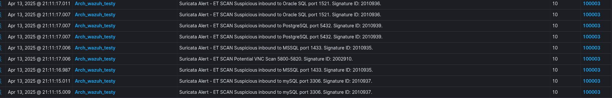
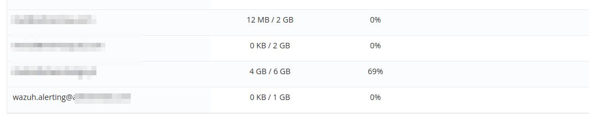
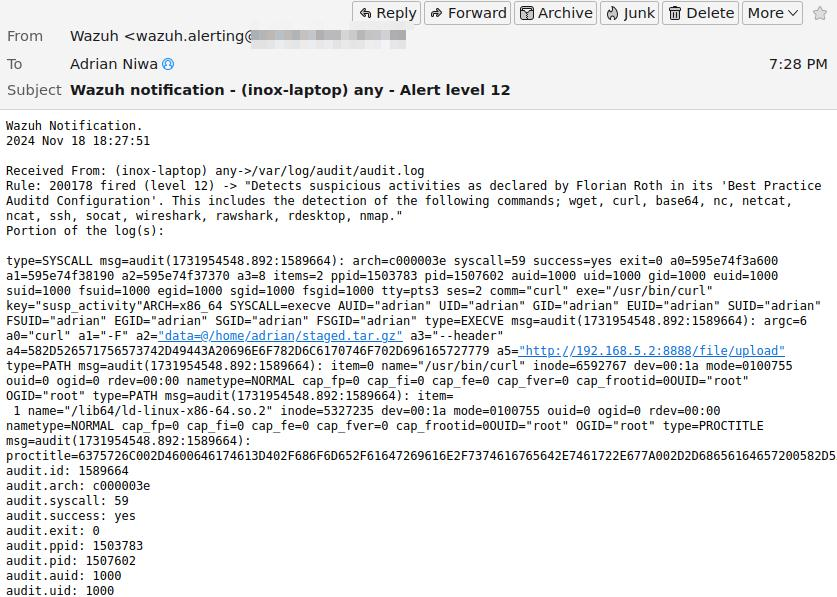

# About

This project is continuation of [This Project](https://github.com/inox-vision/SOC_project).

This is a "does it even work?" part of story, where I try to discover real worth of my work done so far: simulating attacks and observing the outcome.

# Shortcuts

- [TLDR - What's been done](#whats-been-done)

&nbsp;

- [What is Caldera](#caldera)
- [Endpoints](#setup)
- [Initial Simulation](#initial-simulation)
- [Configuring Linux detection](#configuring-for-linux-detection)
  - [Auditd](#auditd)
  - [YARA](#yara)
  - [Suricata](#suricata)
  - [MISP](#misp)
  - [Alienvault CDB lists](#alienvault-cdb-lists)
- [Configuring Windows detection](#configuring-windows-detection)
  - [Sysmon](#sysmon)
  - [YARA](#yara-in-windows)

- [Automating rules updates - WIP](#automating-databases)
- [Active Response - WIP](#active-response)
- [Email alerting](#alerting)


# Caldera


[MITRE Caldera](https://caldera.mitre.org/) is an automated adversary emulation platform. It consists of C2 server and Agents running on target hosts. Agents act like an adversary who got access to the endpoint and established connection with C2 server. Agent performs tasks which relate to [MITRE ATT&CK](https://attack.mitre.org/) framework which is a collection of tactics techniques and procedures used by real world adversaries.

# Setup

Targets:
Several VMs:
- Windows 11,
- Windows Server,
- Arch Linux,
- Ubuntu

in my homelab with same settings as all other endpoints in defended infrastructure.

Attacker:
- Kali VM with Caldera in homelab.


Access via Guacamole:


Wazuh Agents deployed


Caldera Server  deployed


[Back to Shortcuts](#shortcuts)

# Initial simulation

I decided to perform various operations on these endpoints in various conditions. Eg: with Defender on and off, to test how systems perform. Also to find what is being discovered by Wazuh.

Caldera offers predefined operations and I'm going to use some of them. I skipped discovery and collection type operations and decided to perform others, which unidentified would cause bigger harm to the systems.

For Windows operations I performed two simulations, one with Defender left ON with C2 connection executor excluded. And another with Defender turned OFF entirely. I also performed some operations with administrator privilages.

||Name of operation|Windows <br> Defender ON |Windows <br>Defender OFF|Linux|
|-|-|-|-|-|
|1|Alice 2.0|Blocked by Defender at module import|Succeeded|N/A|
|2|Nosy Neighbour|Did not succeed||Wi-Fi has been turned off|
|3|Ransack|Failed on files compression<br>(Succeeded when Agent executed with administrator privilages)|----|Successfully exfiltrated files|
|4|Signer Binary Proxy Execution|Blocked by Defender|Blocked by Defender even though it was turned off|N/A|
|5|Stowaway|Blocked by Defender|Succeeded|N/A|
|6|Super Spy|Failed on payload execution and network traffic sniffing|Failed on payload execution and network traffic sniffing|Succesfully exfiltrated files|
|7|Thief|Failed on files compression<br>(Succeeded when Agent executed with administrator privilages)|----|Succesfully exfiltrated files|
|8|Undercover|Didn't succeed due to a timeout|Succeeded|N/A|
|9|Worm|Blocked by Defender|Succeeded|N/A
|10|You Shall Not Bypass|Failed<br>(With administrator-privileged agent registry has been bypassed, rest failed) |Only Bypass UAC Medium failed|N/A|

###  Summary

- Windows Defender helped preventing most threats on Windows endpoint.
- On linux machine files has been exfiltrated wthout a problem.
- Wazuh did not indicate any malicious activity in both systems.

### Conclusion

Wazuh's default instalation needs further configurations to increase detection rate.

[Back to Shortcuts](#shortcuts)

# Configuring for linux detection

## Auditd

To detect commands executed on endpoint I had to configure logging and log collection of these commands. Then send them to Wazuh to decode and detect with a rule.

1. Install `auditd`

`pacman -S audit`

2. Apply custom audit rules to log use of specific commands (in /etc/audit/rules.d/*):

```
# Suspicious activity
-w /usr/bin/wget -p x -k susp_activity
-w /usr/bin/curl -p x -k susp_activity
-w /usr/bin/base64 -p x -k susp_activity
-w /bin/nc -p x -k susp_activity
-w /bin/netcat -p x -k susp_activity
-w /usr/bin/ncat -p x -k susp_activity
-w /usr/bin/ss -p x -k susp_activity
-w /usr/bin/netstat -p x -k susp_activity
-w /usr/bin/ssh -p x -k susp_activity
-w /usr/bin/scp -p x -k susp_activity
-w /usr/bin/sftp -p x -k susp_activity
-w /usr/bin/ftp -p x -k susp_activity
-w /usr/bin/socat -p x -k susp_activity
-w /usr/bin/wireshark -p x -k susp_activity
-w /usr/bin/tshark -p x -k susp_activity
-w /usr/bin/rawshark -p x -k susp_activity
-w /usr/bin/rdesktop -p x -k T1219_Remote_Access_Tools
-w /usr/local/bin/rdesktop -p x -k T1219_Remote_Access_Tools
-w /usr/bin/wlfreerdp -p x -k susp_activity
-w /usr/bin/xfreerdp -p x -k T1219_Remote_Access_Tools
-w /usr/local/bin/xfreerdp -p x -k T1219_Remote_Access_Tools
-w /usr/bin/nmap -p x -k susp_activity
```
3. Start/enable auditd daemon

`systemctl enable --now auditd.service`

4. Apply specific decoders to parse audit logs:

```
<decoder name="auditd-syscall">
  <parent>auditd-syscall</parent>
  <regex offset="after_regex">key=\((\S+)\)|key="(\S+)"|key=(\S+)</regex>
  <order>audit.key</order>
</decoder>
```
5. Add rules to identify and alert about event:

```
<rule id="200178" level="12">
  <if_sid>200110</if_sid>
  <field name="audit.key">susp_activity</field>
  <description>Detects suspicious activities as declared by Florian Roth in its 'Best Practice Auditd Configuration'. This includes the detection of the following commands; wget, curl, base64, nc, netcat, ncat, ssh, socat, wireshark, rawshark, rdesktop, nmap.</description>
  <group>syscall,</group>
  </rule>
  ```
These rules and decoder has been taken from  [Socfortress Wazuh-Rules repository](https://github.com/socfortress/Wazuh-Rules).
<a href="https://github.com/socfortress/Wazuh-Rules">	  
</a>

## IMPORTANT

In managers `ossec.conf` file in `<ruleset>` part there has to be a native ruleset exclusion added for these rules to work properly:
```
<decoder_exclude>ruleset/decoders/0040-auditd_decoders.xml</decoder_exclude>
```
6. Result:


## YARA

### What is YARA 
YARA rules are used for pattern matching, primarily in malware detection and classification. They're essentially a way to create custom signatures or rules to identify malicious files or patterns within files, often used by security researchers and analysts.

### YARA in Wazuh

1. Wazuh agent scans specified directories for new or modified files;
2. If a new/modified file is detected, rules 550 and 554 are fired;
3. New rules for Yara scanning are activated;
4. These new rules activate active response module on agent machine;
5. Active response module activates Yara binary and scans files that triggered 550 and 554 rules;
6. If Yara scanning outputs positive match with mailicious signature a new rule with alert is triggered.

### Yara integration in Wazuh

Integration steps are well described on [Wazuh Proof-of-concept Yara Guide](https://documentation.wazuh.com/current/proof-of-concept-guide/detect-malware-yara-integration.html)

**1. Instalation**

On Arch: `pacman -S yara`

On Debian, downloading from [source](https://github.com/VirusTotal/yara/releases/tag/v4.5.2) and installing via `bootstrap.sh` script.

Or using apt:
`apt install yara`

**2. Rules**

You can get them in places like [Yara Rules on github](https://github.com/Yara-Rules/rules), but this repository is quite outdated.
[Nextron Systems](https://valhalla.nextron-systems.com/) has some of the best and frequently updated rules.
These can be taken with:

```
mkdir -p /destination for rules/
sudo curl 'https://valhalla.nextron-systems.com/api/v1/get' \
-H 'Accept: text/html,application/xhtml+xml,application/xml;q=0.9,*/*;q=0.8' \
-H 'Accept-Language: en-US,en;q=0.5' \
--compressed \
-H 'Referer: https://valhalla.nextron-systems.com/' \
-H 'Content-Type: application/x-www-form-urlencoded' \
-H 'DNT: 1' -H 'Connection: keep-alive' -H 'Upgrade-Insecure-Requests: 1' \
--data 'demo=demo&apikey=1111111111111111111111111111111111111111111111111111111111111111&format=text' \
-o /tmp/yara/rules/yara_rules.yar
```

**3. Active Response script**

A script that takes filename from rule 550/554 detection and performs yara scanning on. [This script](/yara.sh) has to be put into

`/var/ossec/active-response/bin/`

**4. Realtime folders scanning**

Point to specific directories for realtime scanning.

```
<syscheck>
  <directories realtime="yes">/root</directories>
  <directories realtime="yes">/home</directories>
</syscheck>
```
**5. Provide decoders and rules**

Add local rules to 
`/var/ossec/etc/rules` and `/var/ossec/etc/decoders`.

**6. Configure wazuh-manager for active response**

Add command to `/var/ossec/etc/ossec.conf`

```
<command>
<name>yara_linux</name>
<executable>yara.sh</executable>
<extra_args>-yara_path /usr/local/bin -yara_rules /yara/rules/yara_rules.yar</extra_args>
<timeout_allowed>no</timeout_allowed>
</command>
```

and Active Response action:

```
<active-response>
    <command>yara_linux</command>
    <location>local</location>
    <rules_id>100300,100301,100302,100303</rules_id>
</active-response>
```


## Suricata

[Suricata](https://suricata.io/) is a high performance, open source network analysis and threat detection software used by most private and public organizations, and embedded by major vendors to protect their assets.

**1. Instalation**

On Arch Suricata is available in AUR repository so:
` yay -S suricata`

Ubuntu also keeps it in basic repo: `apt install suricata`

In `/etc/suricata/suricata.yml` change interface name to the one used by this endpoint.

Get rules from 
`wget https://rules.emergingthreats.net/open/suricata-7.0.3/emerging.rules.tar.gz`

Add them to `/var/lib/suricata/rules/` and add them in suricata config file at `rule-files` section in the bottom of file.

Add 
```<agent_config>
  <localfile>
    <log_format>json</log_format>
    <location>/var/log/suricata/eve.json</location>
  </localfile>
</agent_config>
```

to agents config file or agent groups config file if more agents will report with suricata to Wazuh.

**Outcome**
Result of Nmap Scanning



## MISP

[MISP](https://www.misp-project.org/) (Malware Information Sharing Platform & Threat Sharing) is an open-source threat intelligence platform designed to collect, store, share, and correlate indicators of compromise, threat intelligence data, and cybersecurity information between organizations.

The best and easiest way to install MISP is to use a Ubuntu server with [Docker image](https://github.com/misp/misp-docker). Which i did.


 Wazuh communicates with MISP via custom script using API.
 I used [this script](https://github.com/tturba/wazuh/blob/main/custom-misp.py) from Tomasz Turba repo.

 Threw it into `/var/ossec/integrations` in wazuh manager. 
 Put this:
 ```<integration>
<name>custom-misp</name>
<group>sysmon_event1,sysmon_event3,sysmon_event6,sysmon_event7,
sysmon_event_15,sysmon_event_22,syscheck</
group>
<alert_format>json</alert_format>
</integration>
```
into `/var/ossec/etc/ossec.conf`

Obtain MISP API key here:


and update these in `custom-misp.py` script:


Add local rules in `/var/ossec/etc/rules/`:
```
<group name="misp,">
<rule id="100620" level="10">
<field name="integration">misp</field>
<match>misp</match>
<description>MISP Events</description>
<options>no_full_log</options>
</rule>
<rule id="100621" level="5">
<if_sid>100620</if_sid>
<field name="misp.error">\.+</field>
<description>MISP - Error connecting to API</description>
<options>no_full_log</options>
<group>misp_error,</group>
</rule>
<rule id="100622" level="12">
<field name="misp.category">\.+</field>
<description>MISP - IoC found in Threat Intel - Category: $(misp.category), Attribute: $(misp.value)</description>
<options>no_full_log</options>
<group>misp_alert,</group>
</rule>
</group>
```

## AlienVault CDB lists

IP reputation lists to use for blocking malicious traffic.

Get list from [here](https://iplists.firehol.org/?ipset=alienvault_reputation).

Throw it into: `/var/ossec/etc/lists/`.

Get `wget https://wazuh.com/resources/iplist-to-cdblist.py` and write it to `/var/ossec/etc/lists/`.

Execute this script with python and write it as blacklist-alienvault in `lists`:

`python3 /var/ossec/etc/lists/iplist-to-cdblist.py /var/ossec/etc/lists/alienvault_reputation.ipset /var/ossec/etc/lists/blacklist-alienvault`

Add `<list>etc/lists/blacklist-alienvault</list>`
in `<ruleset>` part of `ossec.conf`

Add custom rule which will trigger level 10 alert when src_ip is found in the list:

```
group name="attack,">
<rule id="100100" level="10">
<if_group>web|attack|attacks</if_group>
<list field="srcip" lookup="address_match_key">etc/lists/blacklist-alienvault</list>
<description>IP in black list.</description>
</rule>
</group>
```

# Configuring Windows detection

## Sysmon

For log collection I installed [Sysmon](https://learn.microsoft.com/en-us/sysinternals/downloads/sysmon) with configuration file created by [Olaf Hartong](https://github.com/olafhartong/sysmon-modular/wiki) .

To start logging Sysmon Events in Wazuh I added this setting in Windows agents group config file:

```
  <agent_config>
    <localfile>
      <location>Microsoft-Windows-Sysmon/Operational</location>
      <log_format>eventchannel</log_format>
    </localfile>
  </agent_config>
```
Rules taken from 
 [Socfortress Wazuh-Rules repository](https://github.com/socfortress/Wazuh-Rules).


## YARA in Windows

Yara integration in Windows is covered in [Wazuh documentation](https://documentation.wazuh.com/current/proof-of-concept-guide/detect-malware-yara-integration.html).


# Automating databases

in progress

# Active Response

in progress


# Alerting

Wazuh has integrated various methods of alerting. I chose to receive e-mails whenever alert level 12 or higher is triggered.

- created e-mail alias:


- configured postfix relay (wazuh doesn't natively support SMTP server with authentication)
- configured wazuh ossec.conf

### outcome:



# Automated Caldera Threat Profile creation

To mimic real world threat actor's behaviors I created [python script](https://github.com/inox-vision/caldera-threat-model-automator) which takes JSON file generated using [Control Validation Compass](https://controlcompass.github.io/threat-model), 
strips out TTPs, parses Calderas abilities and creates adversary file containing abilities matching CVC threat model file to use with MITRE Caldera.
It lets you choose platforms for which adversary profile is created. Also custom description can be added. The rest is automatic.


***
# What's been done

- deployed attacker and target endpoints in Proxmox homelab;
- deployed MITRE Caldera server and Wazuh agents;
- installed and configured audit loging in linux;
- updated audit decoders and rules with [SOC Fortress set of rules](https://github.com/socfortress/Wazuh-Rules);
- configured email alerting for level 12 or higher severity alerts;


# --------WIP--------------------
