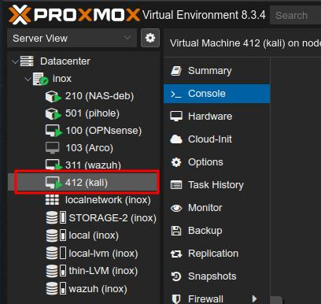

# About

This project is continuation of [This Project](https://github.com/inox-vision/SOC_project).

This is a "does it even work?" part of story, where I try to discover real worth of my work done so far: simulating attacks and observing the outcome.

# Shortcuts

- [TLDR - What's been done](#whats-been-done)
***
- [What is Caldera](#caldera)
- [Endpoints setup](#setup)
- [Initial Simulation](#initial-simulation)
- [Configuring for Linux detection](#configuring-for-linux-detection)


# Caldera


[MITRE Caldera](https://caldera.mitre.org/) is an automated adversary emulation platform. It consists of C2 server and Agents running on target hosts. Agents act like an adversary who got access to the endpoint and established connection with C2 server. Agent performs tasks which relate to [MITRE ATT&CK](https://attack.mitre.org/) framework which is a collection of tactics techniques and procedures used by real world adversaries.

# Setup

Targets:
- Windows 11 VM in my homelab with same settings as all other Win11 endpoints in defended infrastructure
- Least important Arch Linux endpoint.

Attacker:
- Kali VM with Caldera in homelab.



Access via Guacamole:


Wazuh Agents deployed


Caldera Server  deployed


Caldera Agents deployed


[Back to Shortcuts](#shortcuts)

# Initial simulation

I decided to perform various operations on these endpoints in various conditions. Eg: with Defender on and off, to test how systems perform. Also to find what is being discovered by Wazuh.

Caldera offers predefined operations and I'm going to use some of them. I skipped discovery and collection type operations and decided to perform others, which unidentified would cause bigger harm to the systems.

For Windows operations I performed two simulations, one with Defender left ON with C2 connection executor excluded. And another with Defender turned OFF entirely. I also performed some operations with administrator privilages.

||Name of operation|Windows <br> Defender ON |Windows <br>Defender OFF|Linux|
|-|-|-|-|-|
|1|Alice 2.0|Blocked by Defender at module import|Succeeded|N/A|
|2|Nosy Neighbour|Did not succeed||Wi-Fi has been turned off|
|3|Ransack|Failed on files compression<br>(Succeeded when Agent executed with administrator privilages)|----|Successfully exfiltrated files|
|4|Signer Binary Proxy Execution|Blocked by Defender|Blocked by Defender even though it was turned off|N/A|
|5|Stowaway|Blocked by Defender|Succeeded|N/A|
|6|Super Spy|Failed on payload execution and network traffic sniffing|Failed on payload execution and network traffic sniffing|Succesfully exfiltrated files|
|7|Thief|Failed on files compression<br>(Succeeded when Agent executed with administrator privilages)|----|Succesfully exfiltrated files|
|8|Undercover|Didn't succeed due to a timeout|Succeeded|N/A|
|9|Worm|Blocked by Defender|Succeeded|N/A
|10|You Shall Not Bypass|Failed<br>(With administrator-privileged agent registry has been bypassed, rest failed) |Only Bypass UAC Medium failed|N/A|

###  Summary

- Windows Defender helped preventing most threats on Windows endpoint.
- On linux machine files has been exfiltrated wthout a problem.
- Wazuh did not indicate any malicious activity in both systems.

### Conclusion

Wazuh's default instalation needs further configurations to increase detection rate.

[Back to Shortcuts](#shortcuts)

# Configuring for linux detection

To detect commands executed on endpoint I had to configure logging and log collection of these commands. Then send them to Wazuh to decode and detect with a rule.

1. Install `auditd`

`pacman -S audit`

2. Apply custom audit rules to log use of specific commands (in /etc/audit/rules.d/*):

```
# Suspicious activity
-w /usr/bin/wget -p x -k susp_activity
-w /usr/bin/curl -p x -k susp_activity
-w /usr/bin/base64 -p x -k susp_activity
-w /bin/nc -p x -k susp_activity
-w /bin/netcat -p x -k susp_activity
-w /usr/bin/ncat -p x -k susp_activity
-w /usr/bin/ss -p x -k susp_activity
-w /usr/bin/netstat -p x -k susp_activity
-w /usr/bin/ssh -p x -k susp_activity
-w /usr/bin/scp -p x -k susp_activity
-w /usr/bin/sftp -p x -k susp_activity
-w /usr/bin/ftp -p x -k susp_activity
-w /usr/bin/socat -p x -k susp_activity
-w /usr/bin/wireshark -p x -k susp_activity
-w /usr/bin/tshark -p x -k susp_activity
-w /usr/bin/rawshark -p x -k susp_activity
-w /usr/bin/rdesktop -p x -k T1219_Remote_Access_Tools
-w /usr/local/bin/rdesktop -p x -k T1219_Remote_Access_Tools
-w /usr/bin/wlfreerdp -p x -k susp_activity
-w /usr/bin/xfreerdp -p x -k T1219_Remote_Access_Tools
-w /usr/local/bin/xfreerdp -p x -k T1219_Remote_Access_Tools
-w /usr/bin/nmap -p x -k susp_activity
```
3. Start/enable auditd daemon

`systemctl enable --now auditd.service`

4. Apply specific decoders to parse audit logs:

```
<decoder name="auditd-syscall">
  <parent>auditd-syscall</parent>
  <regex offset="after_regex">key=\((\S+)\)|key="(\S+)"|key=(\S+)</regex>
  <order>audit.key</order>
</decoder>
```
5. Add rules to identify and alert about event:

```
<rule id="200178" level="12">
  <if_sid>200110</if_sid>
  <field name="audit.key">susp_activity</field>
  <description>Detects suspicious activities as declared by Florian Roth in its 'Best Practice Auditd Configuration'. This includes the detection of the following commands; wget, curl, base64, nc, netcat, ncat, ssh, socat, wireshark, rawshark, rdesktop, nmap.</description>
  <group>syscall,</group>
  </rule>
  ```
These rules and decoder has been taken from  [Socfortress Wazuh-Rules repository](https://github.com/socfortress/Wazuh-Rules).
<a href="https://github.com/socfortress/Wazuh-Rules">	  
</a>

6. Result:


***
# What's been done

- deployed attacker and target endpoints in Proxmox homelab;
- deployed MITRE Caldera server and Wazuh agents;
- installed and configured audit loging in linux;
- updated audit decoders and rules with [SOC Fortress set of rules](https://github.com/socfortress/Wazuh-Rules).


# --------WIP--------------------
